# ShopStack 3‑Tier Deployment on AWS EC2

## 📖 Overview
This project demonstrates deploying a full‑stack e‑commerce application (**ShopStack**) using a **3‑tier architecture** on AWS EC2:

- **Presentation Layer (Frontend)** → React + Vite served via Nginx (Public EC2)
- **Application Layer (Backend)** → Express.js API managed by PM2 (Private EC2)
- **Data Layer (Database)** → MongoDB 7.0 service (Private EC2)

---

## 🧱 Architecture Setup
- **Frontend EC2 (Public Subnet)**  
  - Runs Nginx, serves built React app, proxies `/api` requests to backend.
- **Backend EC2 (Private Subnet)**  
  - Runs Express.js app with PM2, connects to MongoDB.
- **Database EC2 (Private Subnet)**  
  - Runs MongoDB service, accessible only from backend EC2.

### AWS Networking
- **VPC** with 3 subnets:
  - Public subnet (`10.0.1.0/24`) → Frontend EC2
  - Private subnet (`10.0.2.0/24`) → Backend EC2
  - Private subnet (`10.0.3.0/24`) → Database EC2
- **Security Groups**:
  - Frontend SG → inbound 80/443 from `0.0.0.0/0`
  - Backend SG → inbound 5000 only from Frontend SG
  - Database SG → inbound 27017 only from Backend SG

---

## ⚙️ Setup Steps

1. **Launch EC2 Instances**
   - Frontend EC2 → Ubuntu 22.04, public subnet
   - Backend EC2 → Ubuntu 22.04, private subnet
   - Database EC2 → Ubuntu 22.04, private subnet

2. **Configure Security Groups**
   - Frontend SG: allow inbound 80/443 from anywhere
   - Backend SG: allow inbound 5000 from Frontend SG
   - Database SG: allow inbound 27017 from Backend SG

3. **Configure Route Tables**
   - Public subnet → Internet Gateway
   - Private subnets → Nat Gateway initially used to setup the EC2s with necessary codes, then removed. No IGW.

---

## 🛠️ Configuration Steps

### Frontend EC2 (Nginx + SSL)
Run ```vi frontend.sh;
chmod +x frontend.sh;
./frontend.sh```:

```bash
#!/bin/bash
set -e

# Update and upgrade system
sudo apt update && sudo apt upgrade -y

# Install required packages (without apt's npm)
sudo apt install -y nginx openssl git curl

# Install NVM (Node Version Manager)
curl -o- https://raw.githubusercontent.com/nvm-sh/nvm/v0.39.7/install.sh | bash
export NVM_DIR="$HOME/.nvm"
[ -s "$NVM_DIR/nvm.sh" ] && \. "$NVM_DIR/nvm.sh"
[ -s "$NVM_DIR/bash_completion" ] && \. "$NVM_DIR/bash_completion"

source ~/.bashrc

# Install Node.js (minimum required version for Vite)
nvm install 20.19.0
nvm use 20.19.0
nvm alias default 20.19.0

# Verify versions
node -v
npm -v

# Clone ShopStack repo
git clone https://github.com/Newt20/ShopStack.git
cd ShopStack/frontend

# Clean install dependencies and build
rm -rf node_modules package-lock.json
npm install
npm run build

# Copy build files to Nginx web root
sudo mkdir -p /var/www/ShopStack-frontend
sudo cp -r dist/* /var/www/ShopStack-frontend/

# Generate self-signed SSL certificate
sudo mkdir -p /etc/nginx/ssl
sudo openssl req -x509 -nodes -days 365 -newkey rsa:2048 \
  -subj "/C=US/ST=State/L=City/O=ShopStack/CN=shopstack.local" \
  -keyout /etc/nginx/ssl/shopstack.key \
  -out /etc/nginx/ssl/shopstack.crt

# Create Nginx config file
sudo tee /etc/nginx/sites-available/ShopStack.conf > /dev/null <<EOF
server {
    listen 80;
    server_name 10.0.1.151;
    return 301 https://$host$request_uri;
}

server {
    listen 443 ssl;
    server_name 10.0.1.151;

    ssl_certificate /etc/nginx/ssl/shopstack.crt;
    ssl_certificate_key /etc/nginx/ssl/shopstack.key;

    root /var/www/ShopStack-frontend;
    index index.html;

    location / {
        try_files $uri $uri/ =404;
    }

    location /api/ {
    proxy_pass http://10.0.2.74:5000;
    proxy_set_header Host $host;
    proxy_set_header X-Real-IP $remote_addr;
    }

}
EOF

# Enable site and disable default
sudo ln -sf /etc/nginx/sites-available/ShopStack.conf /etc/nginx/sites-enabled/
sudo rm -f /etc/nginx/sites-enabled/default

# Start and enable Nginx
sudo systemctl start nginx
sudo systemctl enable nginx

# Test and reload Nginx
sudo systemctl reload nginx
sudo nginx -t

echo "✅ Frontend deployment complete. ShopStack frontend is served via Nginx with SSL."
```

### NGINX Conf File
```bash
server {
    listen 80;
    server_name 10.0.1.151;
    return 301 https://$host$request_uri;
}

server {
    listen 443 ssl;
    server_name 10.0.1.151;

    ssl_certificate /etc/nginx/ssl/shopstack.crt;
    ssl_certificate_key /etc/nginx/ssl/shopstack.key;

    root /var/www/ShopStack-frontend;
    index index.html;

    location / {
        try_files $uri $uri/ =404;
    }

    location /api/ {
    proxy_pass http://10.0.2.74:5000;
    proxy_set_header Host $host;
    proxy_set_header X-Real-IP $remote_addr;
    }
}
```

### Backend EC2 (Express.js + PM2)

```bash
#!/bin/bash
set -e

# Update system
sudo apt-get update && sudo apt-get upgrade -y

# Install prerequisites
sudo apt-get install -y gnupg curl git build-essential

# Install NVM
curl -o- https://raw.githubusercontent.com/nvm-sh/nvm/v0.40.1/install.sh | bash
export NVM_DIR="$HOME/.nvm"
[ -s "$NVM_DIR/nvm.sh" ] && \. "$NVM_DIR/nvm.sh"
[ -s "$NVM_DIR/bash_completion" ] && \. "$NVM_DIR/bash_completion"
source ~/.bashrc

# Install Node.js (>=20.19.0)
nvm install 20.19.0
nvm use 20.19.0
nvm alias default 20.19.0

# Verify
node -v
npm -v

# Install PM2 globally
npm install -g pm2

# Clone ShopStack repo
git clone https://github.com/Newt20/ShopStack.git
cd ShopStack/backend

# Install backend dependencies
npm install express mongoose dotenv cors

# Configure environment
if [ -f ".env.example" ]; then
  cp .env.example .env
  echo "✅ .env file created from .env.example"
fi


# Start backend with PM2
pm2 start server.js --name shopstack-backend
pm2 save
pm2 startup systemd -u $USER --hp $HOME

echo "✅ Backend setup complete. Node.js 20 via NVM, ShopStack backend running with PM2."


# IMPORTANT: Update .env with DB private IP
# Example:
# MONGO_URI=mongodb://10.0.3.173:27017/shopstack

```

### Database EC2 (MongoDB 7.0)

```bash
#!/bin/bash
set -e

# Update system
sudo apt-get update && sudo apt-get upgrade -y

# Install prerequisites
sudo apt-get install -y gnupg curl

# Add MongoDB 7.0 repo
curl -fsSL https://pgp.mongodb.com/server-7.0.asc | \
  sudo gpg -o /usr/share/keyrings/mongodb-server-7.0.gpg --dearmor

echo "deb [ arch=amd64,arm64 signed-by=/usr/share/keyrings/mongodb-server-7.0.gpg ] \
https://repo.mongodb.org/apt/ubuntu jammy/mongodb-org/7.0 multiverse" | \
sudo tee /etc/apt/sources.list.d/mongodb-org-7.0.list

# Install MongoDB
sudo apt-get update
sudo apt-get install -y mongodb-org

# Ensure directories exist
sudo mkdir -p /var/lib/mongodb /var/log/mongodb
sudo chown -R mongodb:mongodb /var/lib/mongodb /var/log/mongodb

# Configure MongoDB to bind to private IP
PRIVATE_IP=$(hostname -I | awk '{print $1}')
sudo sed -i "s/^  bindIp: .*/  bindIp: 127.0.0.1,$PRIVATE_IP/" /etc/mongod.conf

# Enable and start MongoDB
sudo systemctl enable mongod
sudo systemctl restart mongod
sudo systemctl status mongod --no-pager

echo "✅ MongoDB 7.0 installed and bound to private IP: $PRIVATE_IP"

```
---

## 📸 Screenshots

### 1. VPC
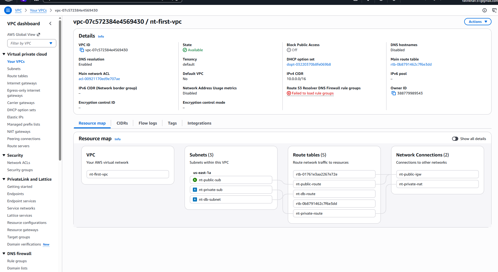

### 2. Public Subnet
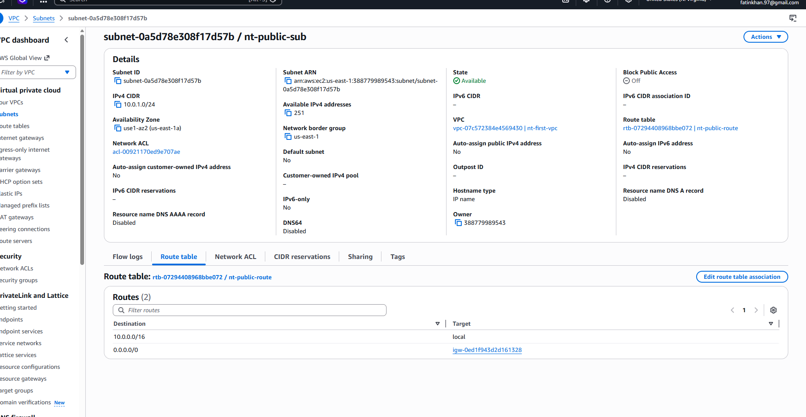

### 3. Private Subnet
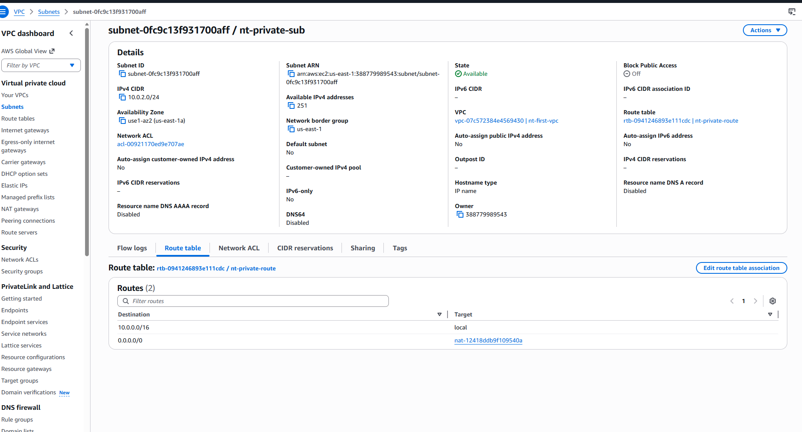

### 4. DB Subnet
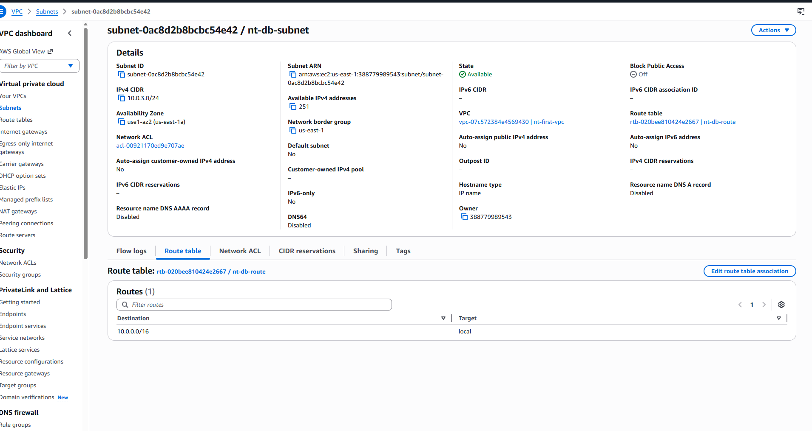

### 5. Public Security Group
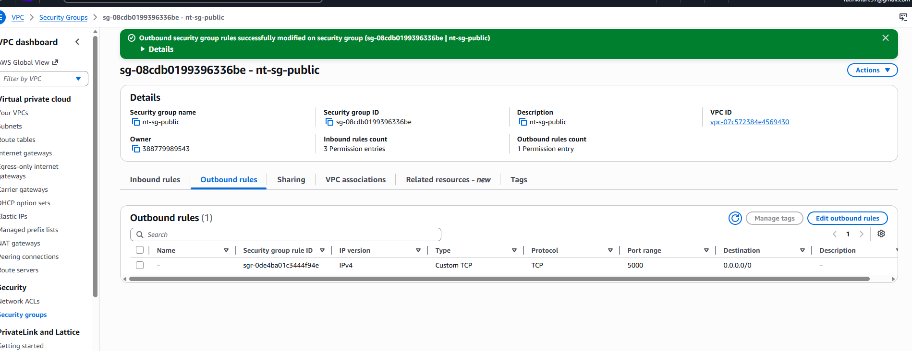

### 6. Private Security Group
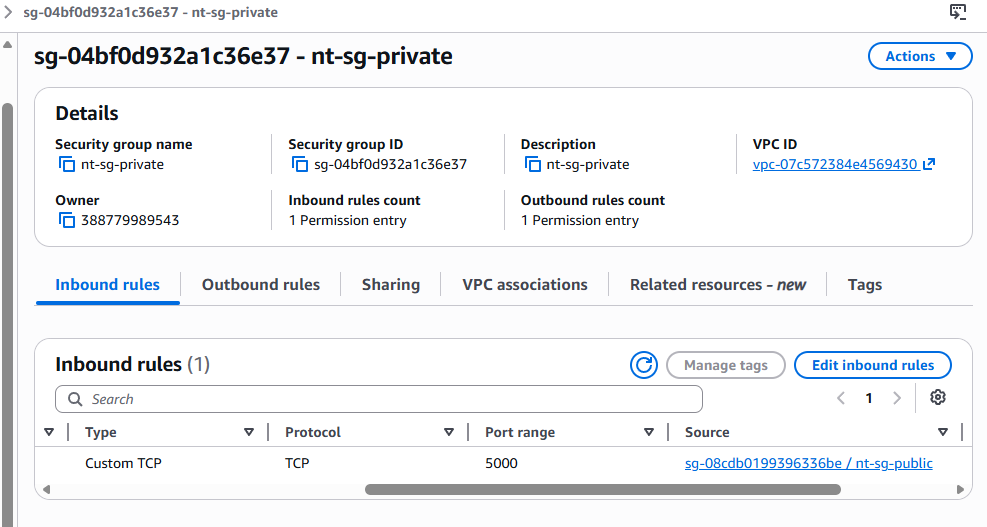

### 7. DB Security Group
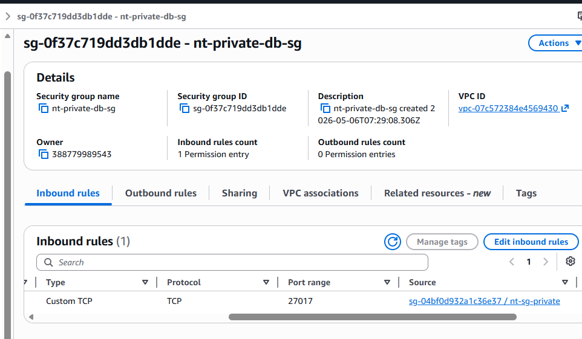

### 8. Public Route
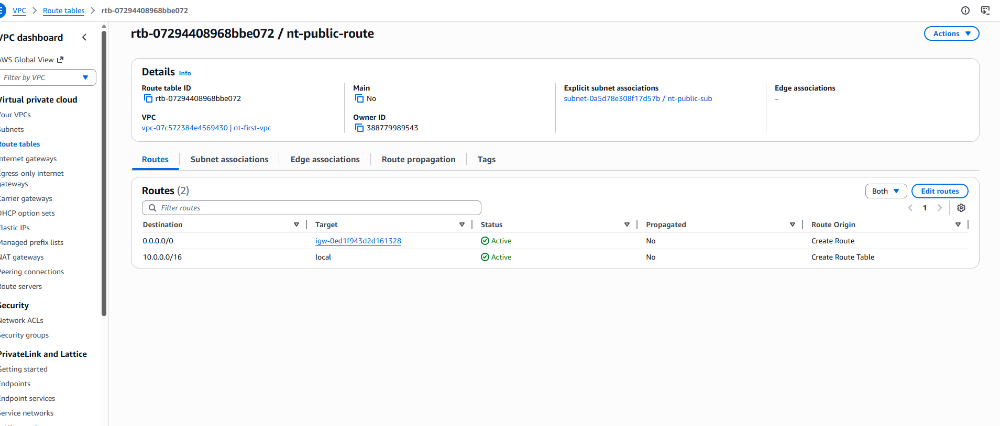

### 9. Private Route
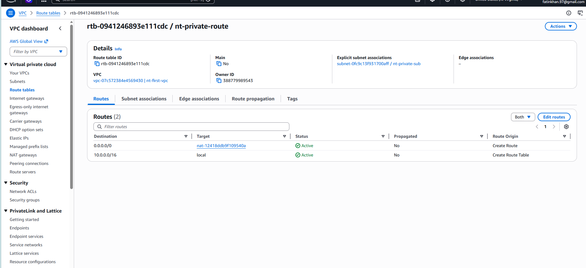

### 10. DB Route
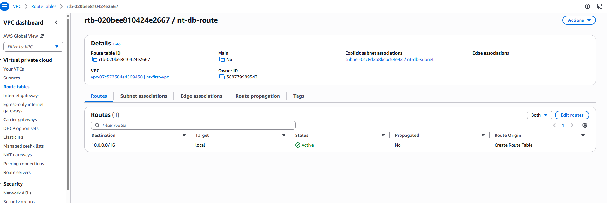

### 11. NAT Gateway
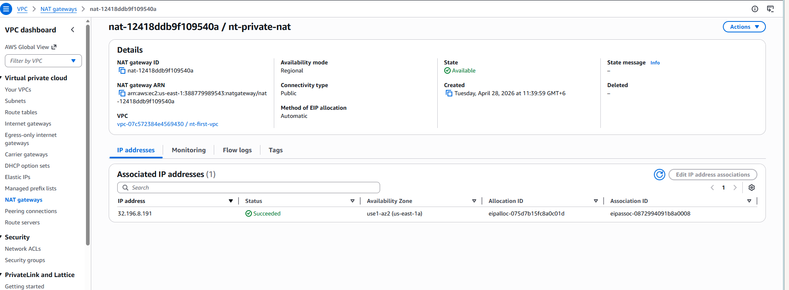

### 12. Internet Gateway
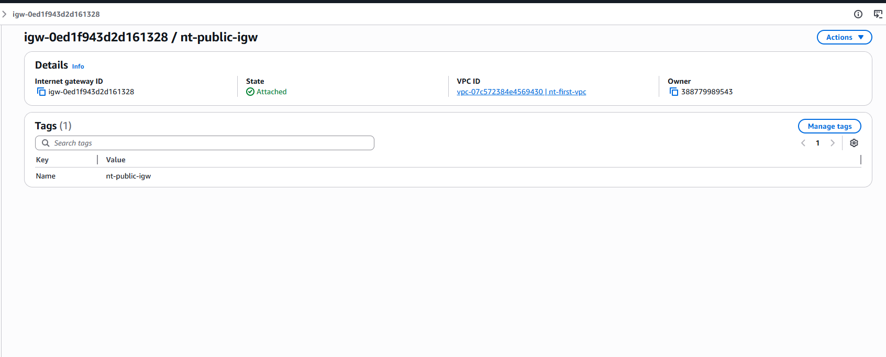

### 13. Public EC2
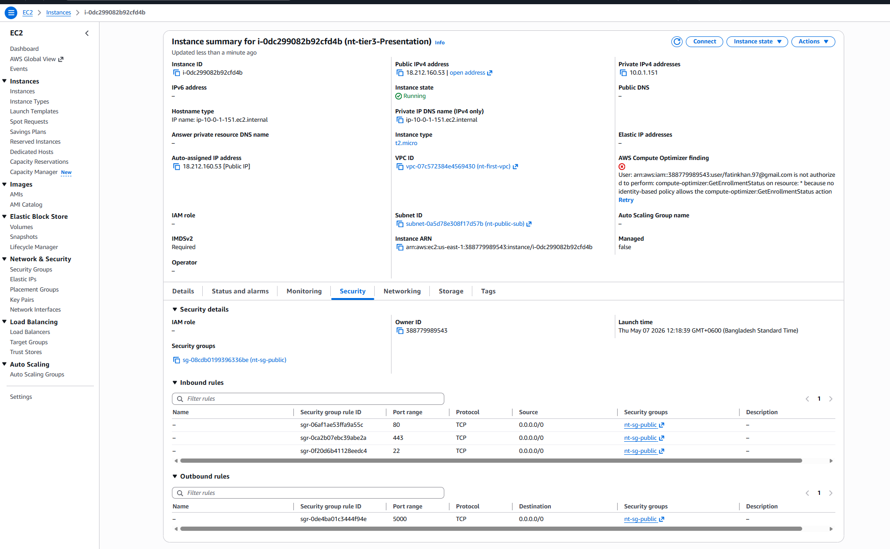

### 14. Private EC2
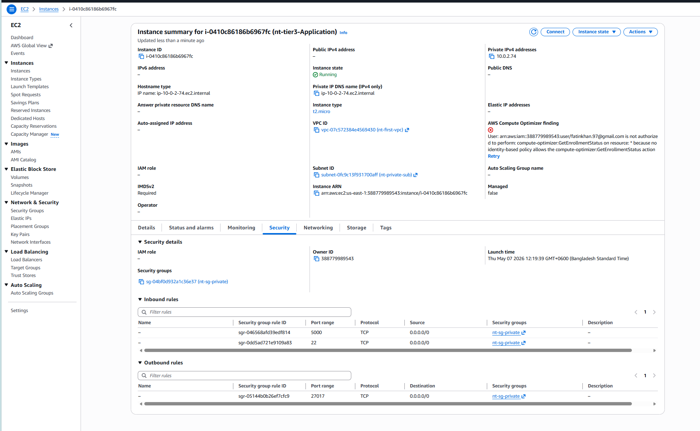

### 15. DB EC2
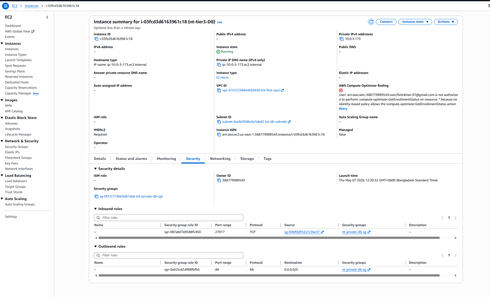

### 16. Curl from FrontEnd EC2 to get data from DB EC2 through api(backend).
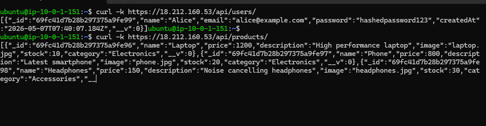

### 17. BackEnd EC2 connected to DB EC2
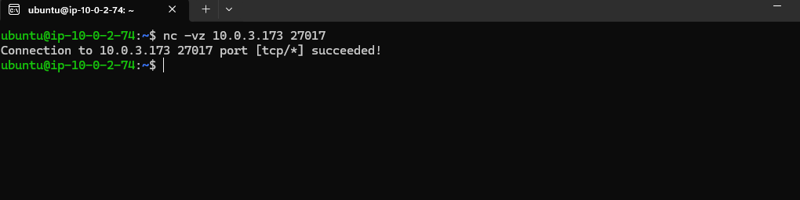

### 18. FrontEnd
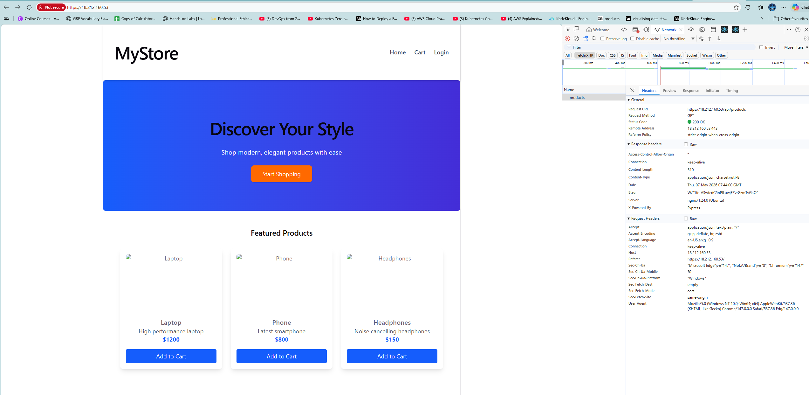

### 19. Logging In
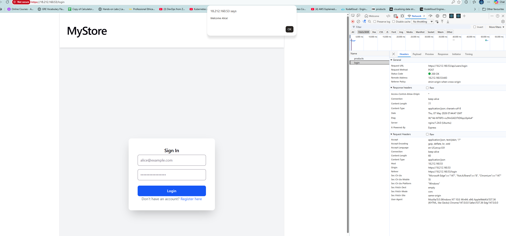

### 20. Adding to Cart
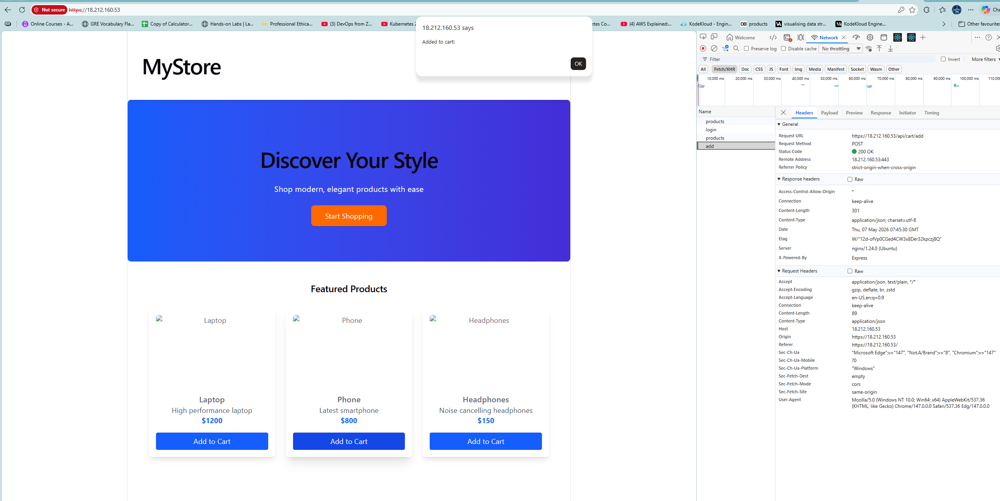

### 21. Cart
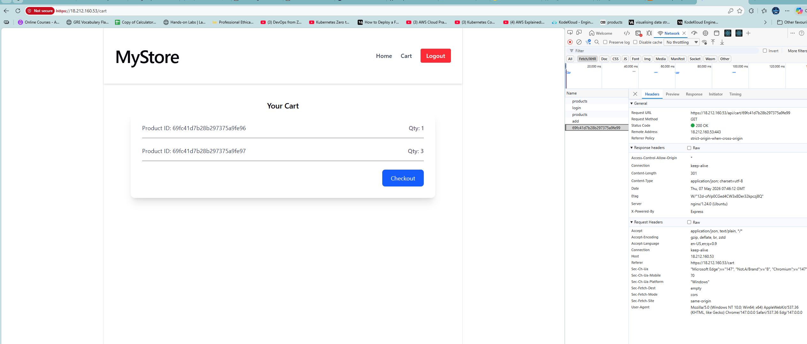

---


## 🖼️ Architecture Diagram

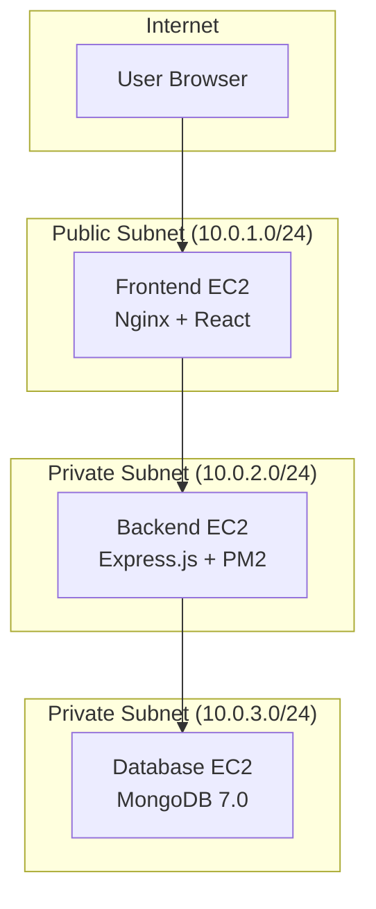

## 🔐 Security Group Relationships (Fixed)

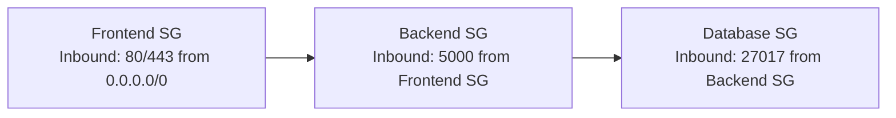
